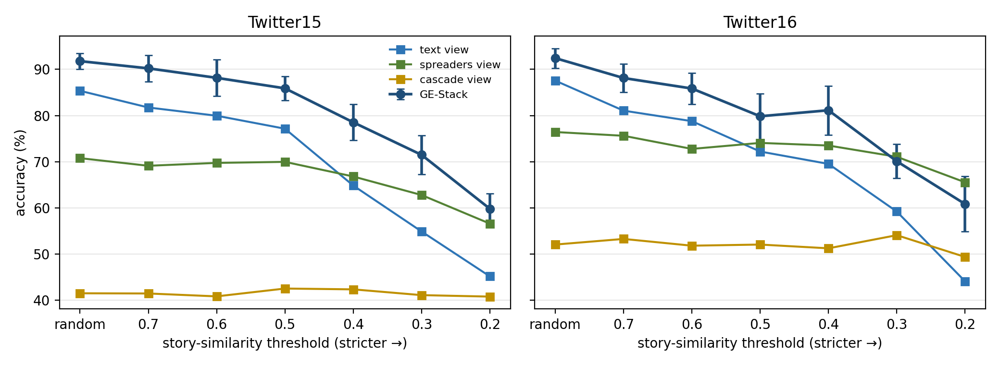
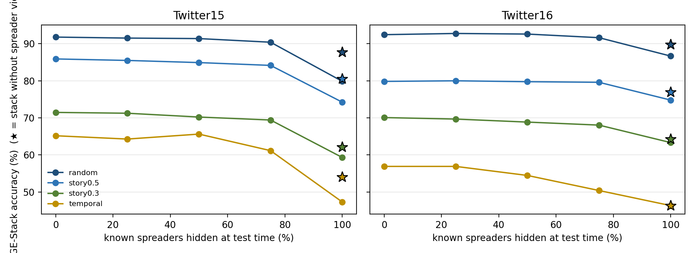

# Fake News Detection on Twitter: Graph-Enhanced Stacked Ensemble


Rumour detection on **Twitter15** and **Twitter16**, using both **what a tweet says** and **how it spreads**.

The headline model, **GE-Stack**, combines three views of every source tweet (its text, the users who spread it, and the timing and shape of its retweet cascade) in a stacked ensemble. On the standard 4-class task it reaches **~92% accuracy**, and it outperforms a fine-tuned DeBERTa-v3 by about 20 points on identical test sets.

---

## Results

4-class task (non-rumour / true / false / unverified). Mean ± std over **10 seeds** (0–9); test sets are never used for fitting.

| Evaluation protocol | Twitter15 | Twitter16 | Gain over text-only |
|---|---|---|---|
| Random stratified 70/15/15 (literature protocol) | **91.79% ± 1.62** (F1 91.77) | **92.44% ± 2.03** (F1 92.44) | +6.4 / +4.9 pts, p < 1e-3 |
| Story-disjoint split (cosine ≥ 0.5) | 85.89% ± 2.44 | 79.84% ± 4.70 | +8.8 / +7.6 pts |
| Story-disjoint split (cosine ≥ 0.3, stricter) | 71.47% ± 4.03 | 70.08% ± 3.50 | +16.6 / +10.9 pts |
| Temporal (train on past, test on newest 15%) | 65.18% | 56.91% | n/a |

### Against neural baselines (same test tweets, Kaggle T4)

| Split | GE-Stack | DeBERTa-v3 | TEG-FND (DeBERTa + MoE) |
|---|---|---|---|
| Twitter15 random | **92.26** | 71.88 | 68.01 |
| Twitter15 story-disjoint | **84.52** | 63.84 | 60.57 |
| Twitter16 random | **92.14** | 70.46 | 70.46 |
| Twitter16 story-disjoint | **82.93** | 62.87 | 60.98 |

On GETAE's **binary** protocol (true vs false, ten 80/20 splits), GE-Stack scores **95.37% / 95.78%**, compared with 82.7% / 89.6% reported in the GETAE paper.

### Extended analysis (per-class, view contributions, robustness)

`scripts/extended_analysis.py` re-uses the same splits and seeds and adds the analyses below. Full numbers are in [`docs/extended_results.json`](docs/extended_results.json).

**Per-class F1 of GE-Stack (%)**: true rumours are the class that suffers most under harder splits.

| Dataset | Protocol | Non-rumour | True | False | Unverified |
|---|---|---|---|---|---|
| Twitter15 | Random | 96.4 | 91.8 | 89.9 | 89.0 |
| Twitter15 | Story-disjoint 0.5 | 93.4 | 85.0 | 85.6 | 79.1 |
| Twitter15 | Temporal | 88.7 | 52.9 | 55.4 | 59.2 |
| Twitter16 | Random | 91.7 | 93.7 | 90.8 | 93.6 |
| Twitter16 | Story-disjoint 0.5 | 78.6 | 86.9 | 74.3 | 78.9 |
| Twitter16 | Temporal | 59.8 | 17.1 | 53.3 | 78.1 |

**Leave-one-view-out (accuracy %, 10 seeds)**: the text view matters most on random splits, the spreader view under harder splits; the cascade view is largely redundant.

| Dataset | Protocol | All views | − cascade | − spreaders | − text |
|---|---|---|---|---|---|
| Twitter15 | Random | 91.79 | 91.88 | 87.72 | 72.01 |
| Twitter15 | Story-disjoint 0.5 | 85.89 | 85.76 | 80.54 | 71.07 |
| Twitter15 | Story-disjoint 0.3 | 71.47 | 71.29 | 62.14 | 65.04 |
| Twitter15 | Temporal | 65.18 | 65.62 | 54.02 | 63.39 |
| Twitter16 | Random | 92.44 | 92.03 | 89.76 | 77.56 |
| Twitter16 | Story-disjoint 0.5 | 79.84 | 79.11 | 76.91 | 74.15 |
| Twitter16 | Story-disjoint 0.3 | 70.08 | 68.37 | 64.23 | 72.93 |
| Twitter16 | Temporal | 56.91 | 53.66 | 46.34 | 53.66 |

**Story-similarity threshold** (cosine τ; lower = stricter story separation). Accuracy %, GE-Stack / text view / spreader view:

| τ | Twitter15 | Twitter16 |
|---|---|---|
| random | 91.8 / 85.4 / 70.8 | 92.4 / 87.6 / 76.4 |
| 0.7 | 90.2 / 81.7 / 69.1 | 88.1 / 81.1 / 75.6 |
| 0.6 | 88.2 / 80.0 / 69.7 | 85.9 / 78.8 / 72.8 |
| 0.5 | 85.9 / 77.1 / 70.0 | 79.8 / 72.2 / 74.1 |
| 0.4 | 78.5 / 64.8 / 66.8 | 81.1 / 69.5 / 73.5 |
| 0.3 | 71.5 / 54.9 / 62.8 | 70.1 / 59.2 / 71.1 |
| 0.2 | 59.8 / 45.1 / 56.6 | 60.8 / 44.1 / 65.5 |



**User-masking stress test** (random splits): a share of the known spreaders is hidden from the test trees, without re-training.

| Known spreaders hidden | 0% | 25% | 50% | 75% | 100% | Stack trained without spreader view |
|---|---|---|---|---|---|---|
| Twitter15 | 91.8 | 91.5 | 91.4 | 90.4 | 79.9 | 87.7 |
| Twitter16 | 92.4 | 92.8 | 92.6 | 91.6 | 86.7 | 89.8 |



**Honest caveats found by this analysis**

- **Classes were collected in different periods.** Tweet ids show that in Twitter15 most true/false rumours date from 2013 to early 2015, while most non-rumours date from late 2015 to 2016 (Twitter16 is similar). Anything that reveals *when* a tweet was posted therefore also hints at its class on a random split; this affects every model on this benchmark.
- **With no known spreaders, drop the spreader view.** If all known users are hidden, the full stack (79.9% / 86.7%) is worse than a stack trained without the spreader view (87.7% / 89.8%), because the meta-learner still trusts a view that has become uninformative.
- **The meta-learner can over-trust text on unseen stories.** On Twitter16 at τ = 0.3 the stack without the text view (72.9%) beats the full stack (70.1%): the out-of-fold folds are random, so sibling tweets make the text view look more reliable than it is. Story-aware cross-fitting is the obvious next step.
- The ± values in the first table above are population standard deviations; `docs/extended_results.json` and the paper use the sample standard deviation (±1.71 / ±2.14 on random splits).

### What the experiments show

- **Propagation features do real work.** They add 5–6 points on random splits and **11–17 points on story-disjoint splits**, so the harder the split, the more they help. On the temporal split, the spreader view alone (59.4%) beats the text view alone (44.2%).
- **Large transformers overfit here.** With about 1k short tweets, the 86M-parameter DeBERTa-v3-based TEG-FND reaches train F1 0.99 but only 0.72 on validation. Sparse n-gram and spreader features with linear models generalise far better.
- **Random-split scores are optimistic.** About 15% of test tweets have a near-duplicate in the training set, which inflates every model on this benchmark, including published ones. The story-disjoint split gives a more honest estimate for unseen stories.

---

## How it works

```
                 ┌─────────────────────────────┐
source tweet ──► │ Text view                   │ word 1-2-gram + char 2-5-gram TF-IDF → LogReg ─┐
                 └─────────────────────────────┘                                                │
                 ┌─────────────────────────────┐                                                ▼
propagation ───► │ Spreader view ("who")       │ bag of user IDs in the cascade → LogReg ──► Meta-learner ──► label
tree             └─────────────────────────────┘                                          (LogReg over
                 ┌─────────────────────────────┐                                           out-of-fold
             ──► │ Cascade view ("how fast")   │ size, unique users, delays, % spread      log-probs)
                 └─────────────────────────────┘ within 5 min / 1 h / 1 day → LogReg ───────────┘
```

The meta-learner is trained on **5-fold out-of-fold predictions**, so it learns how much to trust each view without seeing leaked base-model outputs. Vectorisers, scalers and every model are fit without test data. As a sanity check, shuffling the training labels drops test accuracy to about 21%, roughly chance for 4 classes.

The repo also includes the **neural models** used for comparison and ablation:

- **TEG-FND**: DeBERTa-v3 with multi-view pooling, a 22-feature stylometric branch, cross-view attention, and an adaptive Mixture-of-Experts with a load-balancing loss and an uncertainty head
- **Propagation model**: adds a graph-attention encoder over the propagation tree and a temporal-delay encoder, combined through gated 4-way fusion
- **LIME** explanations for individual predictions

---

## Quick start

```bash
pip install -r requirements.txt

# Headline model: CPU only, ~1-2 minutes, no GPU or model download
python scripts/train_ensemble.py --dataset both                   # random splits
python scripts/train_ensemble.py --dataset both --split grouped   # story-disjoint
python scripts/train_ensemble.py --dataset both --split temporal  # past -> future

# Ablations and comparisons
python scripts/ablation_views.py twitter15 random      # leave-one-view-out
python scripts/binary_getae_protocol.py                # GETAE's binary setup
python scripts/extended_analysis.py                    # per-class, thresholds, user masking (CPU, ~1-1.5 h)
python scripts/run_deberta_baselines.py --out-dir out  # neural baselines (GPU, ~2-3 h)
```

Each run writes per-split metrics, 95% confidence intervals, paired significance tests and the exact test tweet IDs to `results/`, so every number above can be reproduced and compared on identical splits.

## Repository layout

```
configs/        dataset configs (Twitter15, Twitter16, PolitiFact)
data/           Twitter15/16 source tweets, labels and propagation trees; PolitiFact claims
scripts/        training, evaluation, ablation and baseline scripts
src/data/       loaders, propagation-tree parsing, feature extraction
src/models/     GE-Stack ensemble, TEG-FND, graph/temporal encoders, MoE
src/training/   trainer, losses, LR schedules, seeding
src/evaluation/ metrics, uncertainty, evaluation
src/explainability/  LIME explainer
docs/           full experiment log, neural-architecture notes, extended results (JSON) and figures
```

## Notes

- Twitter15/16 results are **4-class**. Many papers (GETAE, EnsembleNet) report binary accuracy, which is an easier task, so compare with care.
- The development history is in [`docs/EXPERIMENT_LOG.md`](docs/EXPERIMENT_LOG.md): what was tried, which bugs were found and fixed in the neural pipeline, and why the final model is a stacked ensemble rather than a transformer.

## Datasets

Twitter15 and Twitter16 come from Ma et al., *Detect Rumors in Microblog Posts Using Propagation Structure via Kernel Learning* (ACL 2017). PolitiFact claims are used for text-only experiments.
